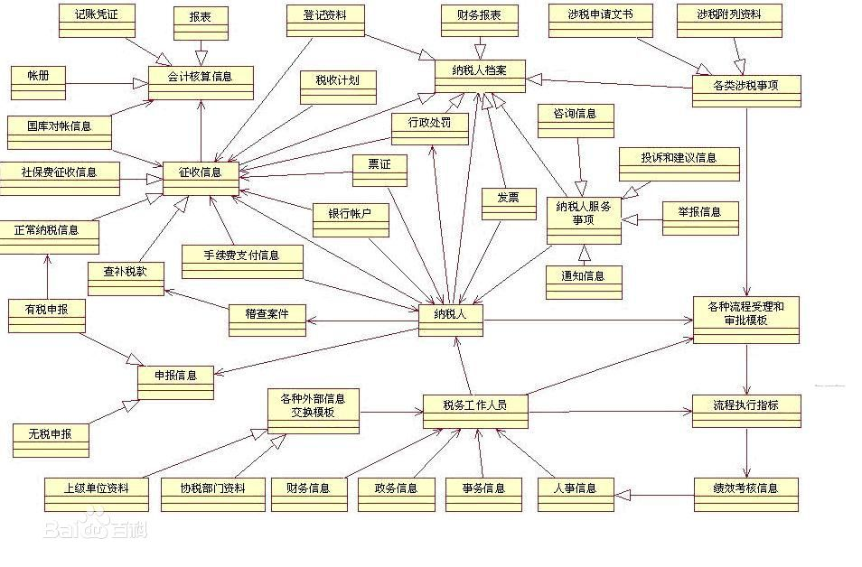

#  领域模型
领域模型是对领域内的概念类或现实世界中对象的可视化表示。又称概念模型、领域对象模型、分析对象模型。它专注于分析问题领域本身，发掘重要的业务领域概念，并建立业务领域概念之间的关系。

## 概念
业务对象模型（也叫领域模型 domain model）是描述业务用例实现的对象模型。它是对业务角色和业务实体之间应该如何联系和协作以执行业务的一种抽象。业务对象模型从业务角色内部的观点定义了业务用例。该模型为产生预期效果确定了业务人员以及他们处理和使用的对象（“业务类和对象”）之间应该具有的静态和动态关系。它注重业务中承担的角色及其当前职责。这些模型类的对象组合在一起可以执行所有的业务用例[1]  。

## 核心元素

业务角色显示了一个人承担的一系列职责。业务实体表示使用或产生的可交付工件、资源和事件。业务用例实现显示了协作的业务角色和业务实体如何执行某个工作流程。使用以下几种图来记录业务用例实现： 图显示参与的业务角色和业务实体。活动图，其中泳道显示业务角色的职责，而对象流显示如何在工作流程中使用业务实体。 序列图描述业务角色和业务主角之间交互的详细情况，并显示如何在业务用例执行过程中访问业务实体。
业务对象模型将结构的概念和行为的概念结合了起来。

>它是一个纽带工件，用于对业务关系进行清晰的表述，表述方式与软件开发人员的思考方式类似，同时仍保留一些纯粹的业务内容。将我们所知道的有关业务的信息按照对象、属性和职责进行了合并。
它探索业务领域知识的本质，所采用的方式使我们能够从对业务问题的思考转变到对软件应用程序的思考上来。

>它是一种确定需求的方法，使需求能够为待建信息系统使用，并得到该系统的支持。
确定业务对象定义、对象间关系、对象名称和对象间关系名称的流程使我们能够以一种能被业务领域专家理解和验证的精确方式来表达业务领域知识。

##  领域事件
领域事件是应用系统中众多事件的一种分类。企业级应用程序事件大致可以分为三类：系统事件、应用事件和领域事件。领域事件的触发点在领域模型（Domain Model）中，故以此得名。通过使用领域事件，我们可以实现领域模型对象状态的异步更新、外部系统接口的委托调用，以及通过事件派发机制实现系统集成。在进行实际业务分析的过程中，``如果在通用语言中存在“当a发生时，我们就需要做到b。”这样的描述，则表明a可以定义成一个领域事件。`` 领域事件的命名一般也就是“产生事件的对象名称+完成的动作的过去式”的形式，比如：订单已经发货的事件（OrderDispatchedEvent）、订单已被收货和确认的事件（OrderConfirmedEvent）等。在当前的Byteart Retail案例的源代码中，就引入了这两种领域事件。事实上针对该案例而言，还有很多地方可以使用领域事件，比如当客户地址变更时，可以通过事件处理器来更新所有该事件发生前所有未发货订单的客户收货地址等
