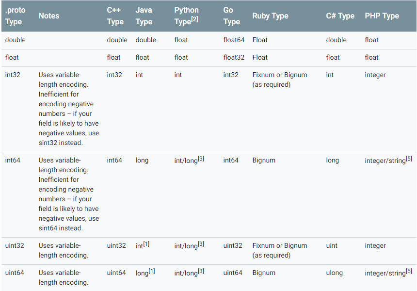
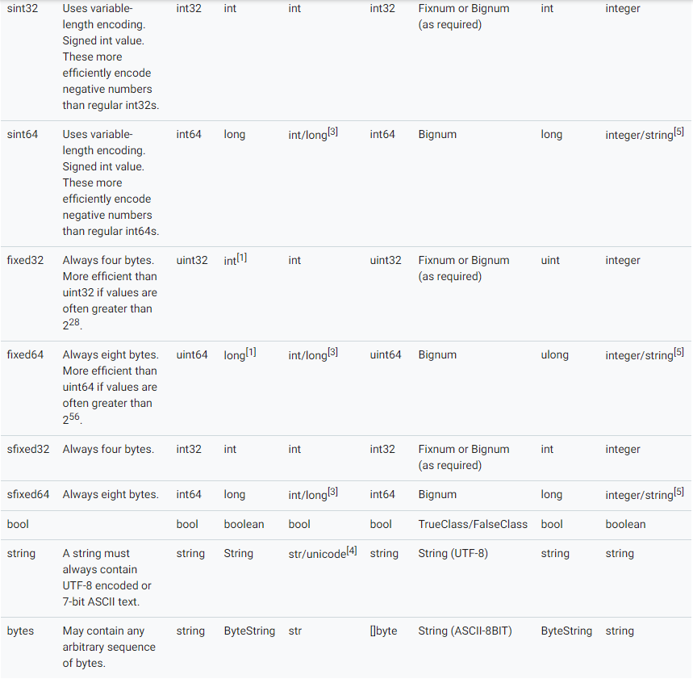
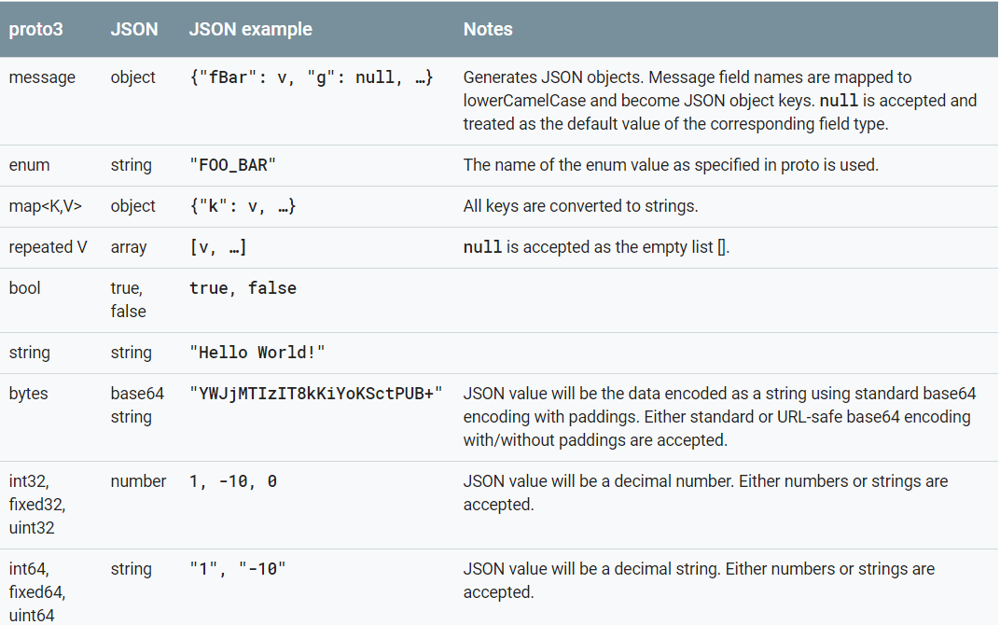
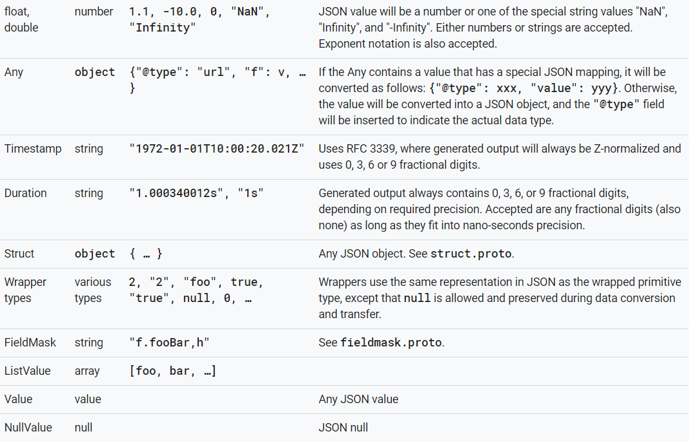

# 概述
这篇引导将介绍如何使用proto buffer 语言去组织你的proto buffer 数据， 包含 .proto文件语法和如何通过.proto文件产生数据入口类文件，这里讲述包含第三版protocol buffer 语言，获取更多老版proto2信息，请自行查阅, [proto2](https://developers.google.com/protocol-buffers/docs/proto)

# 定义一个消息类型
首先让我们查看一个简单例子。假如你想去定义一个搜索请求消息， 每一个搜索请求包含请求关键词query、查询页数page_number，还有每页结果条数result_per_page。下面的.proto文件可以用来定义这个消息类型:
````
syntax = "proto3";

message SearchRequest {
  string query = 1;
  int32 page_number = 2;
  int32 result_per_page = 3;
}
````
- 第一行定义说明你是用的是proto3的语法，如果没有，默认使用proto2语法，文件中第一行必须是一条非空和非注释的语句
- SearchRequest 消息定义了三种不同的字段(成对的name-value)，可以在每个需要该消息的文件中引入，每个字段都有一个名字和类型

## 定义字段类型
上面例子总包含两种字段类型, 都是标量类型-两个整形(page_number 和 result_per_page) 和一个字符串类型(query)。但是，你可能需要其他类型去组合你的字段，例如枚举类型和其他类型.
## 设置字段标签
正如你所看到的一样，每一个消息字段都会定义一个唯一的数字化标签，这些标签将会用来标识你的字段在消息中的二进制格式, 一旦你的消息类型在使用了就不应该再改变了。注意1-15的标签值占用1byte去编码，包括识别号码和字段的类型.16-2047标签值占用2bytes编码。所以你应该确保大量字段保存在1-15的标签纸，并且为未来可能大量使用的字段预留空间.
最小的标签值可以指定为1， 最大的为2^29-1 或者536，870，911.但是你不能使用19000-19999的标签值,因为它们作为了协议的缓存实现，当然也不能使用先前已经保存的标签,否则编译器会报错。
## 指定字段规则
消息字段可指定如下规则：
- 单数（singular）：一个格式良好的消息可以有零个或者一个这个字段-但是不超过一个
- 重复 (repeated) : 一个格式良好的消息可以重复该字段任意次（包括零次）, 重复次序将会保存。
在proto3里面, 重复字段是标量型数字将会默认使用打包编码.
## 添加更多的消息类型
多个消息类型可以定义在同一个.proto文件里，当你需要定义多个相关联的消息时这是非常有用的.例如你可以定义SearchResponse消息作为请求消息的回应，如下：
````
message SearchRequest {
  string query = 1;
  int32 page_number = 2;
  int32 result_per_page = 3;
}

message SearchResponse {
 ...
}
````
## 添加注释,
可以使用c/c++风格的注释, // 或者 /*...*/

````
/* SearchRequest represents a search query, with pagination options to
 * indicate which results to include in the response. */

message SearchRequest {
  string query = 1;
  int32 page_number = 2;  // Which page number do we want?
  int32 result_per_page = 3;  // Number of results to return per page.
}
````
## 预留字段
````
message Foo {
  reserved 2, 15, 9 to 11;
  reserved "foo", "bar";
}

````
如果未来有用户尝试使用如上预留的名称和标签数字，编译器编译时将会报错，注意同一个reserved中不能混合存放名称和标签数字
## 通过.proto编译会产生什么
当你使用proto buffer编译时将会产生你选择的开发语言所对应的代码，包括get和set字段值，序列化你的消息输出和解析你的消息输入.
-针对Go语言,将会为你每一个消息类型生成.pb.go文件


# 标量类型
一个标量消息字段可以有如下类型:



默认值：
- strings =>empty string
- bytes => empty bytes
- bools => false
- numeric => zero
- enums => 第一个定义的enum类型值，应该为0
要注意，如果将标量消息字段设置为它的默认值，则该值将不会被串行化

## 枚举类型
当你定义一个消息类型时，你可能想要定义一个包含预定义值的字段。例如为搜索请求消息添加一个字段corpus-词库， 词库可能包含如下关键词-UNIVERSAL, WEB, IMAGES, LOCAL, NEWS, PRODUCTS 或者 VIDEO， 你可以添加一个枚举类型将所有可能的词加入常量，示例如下:
````
message SearchRequest {
  string query = 1;
  int32 page_number = 2;
  int32 result_per_page = 3;
  enum Corpus {
    UNIVERSAL = 0;
    WEB = 1;
    IMAGES = 2;
    LOCAL = 3;
    NEWS = 4;
    PRODUCTS = 5;
    VIDEO = 6;
  }
  Corpus corpus = 4;
}
````
正如你所看到的，枚举类型的第一个常量词对应0， 每个枚举类型的第一个常量均应如此， 有两点原因：
- 1、必须有一个零值，我们可以使用数字0作为默认值
- 2、零值作为第一行，能够兼容proto2协议-第一行作为默认值

你可以通过添加 allow_alias = true 表述在不同枚举类型定义统一名称常量, 否则编译器发现同义词将会报错

````
enum EnumAllowingAlias {
  option allow_alias = true;
  UNKNOWN = 0;
  STARTED = 1;
  RUNNING = 1;
}
enum EnumNotAllowingAlias {
  UNKNOWN = 0;
  STARTED = 1;
  // RUNNING = 1;  // Uncommenting this line will cause a compile error inside Google and a warning message outside.
}
````
枚举常量必须是在32位整形常量范围内,自从枚举类型串行化时使用varint类型编码，编码负数效率比较低下，所以不太推荐。 如果枚举类型在消息类型外定义，可以起到重复利用的好处。另外你可以定义一个枚举消息类型，利用如下语法
````
MessageType.EnumType
````
如果你使用proto buffer编译器编译一个包含枚举类型的文件，不同语言会生成不同的格式
在反序列化的过程中，未确认的枚举值将会在消息中保存，这些值反序列后如何表达取决于不同的语言，如c++和Go，未知枚举值被简单地存储为其底层整数表示

## 使用其他消息类型
你可以使用其他的消息类型作为字段类型, 例如你可以在SearchRespone消息中包含一个结果消息类型, 示例如下：
````
message SearchResponse {
  repeated Result results = 1;
}

message Result {
  string url = 1;
  string title = 2;
  repeated string snippets = 3;
}
````
上述定义在同一个消息文件中， 如果定义在不同文件中可以通过import引入：
````
import "myproject/other_protos.proto";
````
默认情况下你只能使用已经引入已经定义好的.proto文件， 然而，有时你可能移动一个.proto文件到一个新的位置。在不改变所有引入proto文件的情况下，你可以使用一个废弃的旧文件里去引入新的文件位置使用 import public 关键字，示例如下：
````
// new.proto
// All definitions are moved here

// old.proto
// This is the proto that all clients are importing.
import public "new.proto";
import "other.proto";

// client.proto
import "old.proto";
// You use definitions from old.proto and new.proto, but not other.proto
````

编译器将会查找输入参数 -I / --proto_path下的文件，如果没有提供该参数，编译器将会查找编译调用的目录， 通过情况下你应该社会该参数为你的项目根目录， 并且将所有引入使用全路径

## 使用proto2消息类型
可以在proto3中使用proto2消息，但是proto2的枚举类型不能直接在proto3语法中使用,如果时引入的Proto2消息那是可以的。

# 嵌套定义
你可以在一个消息类型中定义和使用另一个消息类型,如下所示：
````
message SearchResponse {
  message Result {
    string url = 1;
    string title = 2;
    repeated string snippets = 3;
  }
  repeated Result results = 1;
}
````
如果想在这个消息外的消息中使用，可以使用Parent.type格式
````
message SomeOtherMessage {
  SearchResponse.Result result = 1;
}
````
你可以按照自己的想法多层嵌套
````
message Outer {                  // Level 0
  message MiddleAA {  // Level 1
    message Inner {   // Level 2
      int64 ival = 1;
      bool  booly = 2;
    }
  }
  message MiddleBB {  // Level 1
    message Inner {   // Level 2
      int32 ival = 1;
      bool  booly = 2;
    }
  }
}
````
# 更新一个消息类型
如果一个消息类型不再满足你的所有需求-例如, 你想消息中添加一个额外的字段，但是你仍然想使用老格式产生的代码，不用担心，在不破坏你原有代码的情况下可以很简单的更新你的消息。只要记住如下规则:
- 不要改变任何已经存在的数字标签
- 任何新的字段应该时可选或者重复型，这意味着任何老消息类型生成的代码都能被你新生成的代码识别，因为他们不会错过任何强要求required类型，你应当为这些字段提供默认值，这样新产生代码能够正确的与老代码打交道。不过，未知的字段并未废弃，如果消息延迟序列化，那么未知字段将会跟着一起延迟，新字段依然有效.
-如果新消息字段中有的数字标签不会再使用了，非强制要求字段required可以被删掉. 你还可以重命名或者添加前缀，或者使用reserved字段预留，防止被其他用户使用
- 一个非强制性字段能够转变为可扩展字段(extension)或者副字段（vice versa）, 只要类型和数字保持相同.
-  int32, uint32, int64, uint64和布尔型bool都是兼容的-意味着你可以在不影响向前或者向后兼容的情况下更改其中任意一种类型到另一种类型。如果改变的类型不适合实际类型，在c++语言中同样的效果会反应在代码中（例如一个64-位数字改为32数字，将会缩短32位数字）。
- sint32和sint64能够相互兼容，但是不兼容整形
- 只要bytes是有效的UTF-8类型，那么string和bytes类型能够相互兼容
- 如果bytes包含一段编码消息，嵌套消息时可以兼容的
- fixed32和 sfixed32字段是兼容的，fixed64和sfixed64字段是相互兼容的
- optional和repeated兼容。假设序列化数据是一个重复性的输入字段， 客户端期望这个字段改为可选的这样接收最后一个输入数据即使是原始类型或者合并所有数据如果它是消息类型的数据。
- 改变默认值通常都是可行的，只要你记住默认值是不会被串行化的。 因此，如果一段程序接受到一个赋值的字段，他将会查找该程序段内定义的默认值，不会参考发送方程序段默认值
- enum枚举类型和int32/uint32/int64/uint64等一系列串行化格式（注意不适合值将会缩短），但是你必循清楚当消息解码时可能会不同对待。 明显的，未识别的枚举类型将会丢弃在消息解码时，这样会导致访问该字段返回false， 或者返回列表值的第一项或者默认值。在重复性的枚举字段类型下，任何未识别类型字段将会剔除，然而，整形总会保存它的值。 因此，你应该小心升级整形到枚举类型防止接受值超出范围。
- 在当前java和c++类型中，当未知的枚举类型被剥离，它们将会被存储为其他未知类型的字段。注意这会导致在序列化和客户端反序列化识别过程中导致一个奇怪的行为，在一些可选字段情况下，在反序列化中即使新值被写入，老值仍然会被读取的客户端识别。在一些重复字段情况下，这些老值将会出现在已经识别或者新加值后面，意味着排序将不会被保存。

# 扩展
扩展能够让你在消息内提供一些范围数字供第三方扩展，扩展为原始未定义字段提供一个占位符。 这样允许其他该消息的proto文件可以使用这些数字标签，例如：
````
message Foo {
  // ...
  extensions 100 to 199;
}
````
上面表述的是Foo中的数字范围[100, 199]保存为扩展类型。 其他用户现在可以在他们自己的proto文件添加你指定范围内的新字段，如下：
````
extend Foo {
  optional int32 bar = 126;
}
````
当你的用户对Foo信息进行编码，如果用户在消息中定义一个新字段，在线格式是一样的。然而，你访问扩展字段和访问普通字段有些许不同- 你产生的代码对于扩展字会生成特殊的访问器， 可以查看对应语言参考。
注意，扩展类型除了maps类型外，可以是任何类型，包括消息类型

## 嵌套扩展
你可以在其他类型中定义一个扩展类型
````
message Baz {
  extend Foo {
    optional int32 bar = 126;
  }
  ...
}
````
上面的例子，c++访问这个扩展的方法如下：
````
Foo foo;
foo.SetExtension(Baz::bar, 15);
````
换句话说，只会影响 Baz下的bar类型
````
注意：这是一个普通的让人疑惑的点：在消息类型中定义的扩展类型并不意味着同外部类型和其他扩展类型有关系。特别的，上面例子并不意味着Baz是Foo的子类。它只意味着符号bar是在Baz域中定义的的，简单来说算是一个静态成员
````
如果要定义扩展类型作为Baz的一部分，你可以如下定义：
````
message Baz {
  extend Foo {
    optional Baz foo_ext = 127;
  }
  ...
}
````
但是这种定义，你可以放在外部定义，如下：
````
message Baz {
  ...
}

// This can even be in a different file.
extend Foo {
  optional Baz foo_baz_ext = 127;
}

````
实际上，这种语法可以避免歧义。如上所描述，嵌套语法会使不熟悉扩展的用户错误。

## 选择扩展数字
非常重要的是要确保两个不同的用户不在同一个消息扩展中使用同样的数字标签，否则可能导致数据损坏。你可能会考虑定义一个扩展数字约定以避免上面的问题。
如果你的数字约定可能包含很大的数字，你可以指定数字最大值为可能最大值：
````
message Foo {
  extensions 1000 to max;
}
````
最大是229 - 1, 或者 536,870,911
当然你的数字类型不能使用19000-19999范围，这些字段已使用

# 择一（oneof）
当你定义的消息中同时有很多可选字段，你可以使用oneof标记减少内存消耗。
oneof 字段很像可选字段除了所有字段共享内存外，并且同时只能设置为一个字段。设置oneof中的任意字段，其他字段将会被自动清掉。你可以通过使用case()或者whichOneof()方法判断哪个值被设置了。这个也依赖于你选择的语言。

## 使用Oneof, 实例如下：
````
message SampleMessage {
  oneof test_oneof {
     string name = 4;
     SubMessage sub_message = 9;
  }
}
````
你可以在Oneof定义中添加oneof字段，你可以添加除了required， optional，repeated字段外的任意类型。
在你产生的代码中，oneof字段同样产生可选的getters和setters方法，你同时能够得到一个检查可检查当前设置值的方法，可参考对应的语言文档。

## Oneof特点
- 设置oneof字段，会自动清楚oneof中其他成员的值，后一个值设置会覆盖前一个值。
````
SampleMessage message;
message.set_name("name");
CHECK(message.has_name());
message.mutable_sub_message();   // Will clear name field.
CHECK(!message.has_name());
````
- 如果分析器遇到多个在线的相同的oneof类型数据，最后一条将会被使用
- 扩展类型不支持Oneof类型
- oneof类型可以是repeated类型
- 映射api适用于oneof字段
- 如果你是使用c++，确保你的代码不会导致内存溢出，下面代码将会出现因为sub_message消息通过set_name()方法已经被清除了：
````
SampleMessage message;
SubMessage* sub_message = message.mutable_sub_message();
message.set_name("name");      // Will delete sub_message
sub_message->set_...            // Crashes here
````
- 再次在c++中，如果交换oneof类型消息，每个消息将会结束当前字段使用对方字段，如下，msg1 将会拥有一个sub_message，并且msg2将会拥有一个name：
````
SampleMessage msg1;
msg1.set_name("name");
SampleMessage msg2;
msg2.mutable_sub_message();
msg1.swap(&msg2);
CHECK(msg1.has_sub_message());
CHECK(msg2.has_name());
````

## 向后兼容性问题

在增加或者删除oneof字段时一定要小心，如果检查到oneof字段返回None/not_set, 这意味着这个oneof字段未设置或者在不同版本进行设置了。没法区分，因为不能区分未知字段是否是oneof字段

## 标签重用问题
- 将字段移进或者移除oneof：在序列化和解析过程中你可能会丢失一些信息（有些信息可能会被清掉）
- 删除一个oneof字段后来又添加：这样可能会清空你当前oneof设置，在消息序列化和解析过程中
- 分割或者合并oneof：这个影响类似移动普通的字段

# 映射（maps）
如果你想在你的数据定义中创建一个联想的映射类型， protocol buffers提供了一个便捷的语法：
````
map<key_type, value_type> map_field = N;
````
key_type可以是积分或者字符串类型（所以，任何除了浮点型或者bytes类型的标量类型都可以）。 注意枚举类型不是一个有效的key_type,value_type可以是任何除了是其他map类型的类型。

举个例子，如果你想创建一个映射关联每个project消息，你可以如下定义：
````
map<string, Project> projects = 3;
````
- map 字段不能够重复
- 在线排序或者迭代排序是不明确的，所以你不能依赖你的map项会在特定的排序中
- 当在.proto中产生了文本格式数据，maps会按照key来排序，数字key按照向上排序
- 当解析在线或者合并数据时，如果是复制的map keys最后一个将会被使用。如果在解析文本数据格式时有两个key解析将会失败

产生map api代码在proto3协议中支持。

## 向后兼容性
map语法和下面在线的是等价的，所以 proto buffers 如果不支持maps仍然能够处理你的数据：
````
message MapFieldEntry {
  key_type key = 1;
  value_type value = 2;
}

repeated MapFieldEntry map_field = N;
````

# 包（Packages）
你可以选择使用package标记一个.proto文件防止协议消息类型间产生命名冲突
````
package foo.bar;
message Open { ... }
````
你在引用其他消息类型定义自己的类型时，可以指定是那个包的：
````
message Foo {
  ...
  foo.bar.Open open = 1;
  ...
}
````
不同语言产生的代码会有不同的影响
- Go语言, package标签会被当作go package包名，除非你明确的提供一个可选的go_package项

## 包和名字解决方案
在protocol buffer 中类型名称工作机制类似c++，先在内部查找，提前的.号(如 .foo.bar.Baz) 意味着在外部域中查找。

protocol buffers 编译器将会通过解析所有引入的.proto文件解决类型名称问题。代码产生器知道如何对照不同的语言产生不同的代码，即使有不同的标准

# 定义服务-Services
如果你想在远程调用中使用你定义的消息，你可以在一个.proto文件中定义好一个rpc服务接口，然后编译器可以产生对应语言的接口代码。例如你可以定义一个rpc服务去处理searchRequest和返回 searchReponse,你可以像下面这样定义：
````
service SearchService {
  rpc Search (SearchRequest) returns (SearchResponse);
}
````
最直白使用protocol buffer的rpc系统是grpc，当然也可以使用在其他rpc系统中

# JSON 编码参照
proto3支持典型的json格式编码，使得不同系统间可以轻松分享数据。这些编码描述在下面的都是基础的类型对类型的。
如果在编码时值缺失或者值为null，在protobuffer解析时会赋值合适的默认值。如果一个字段在定义时有默认值，在压缩数据时该字段的值将会忽略，解析时会赋值对应的默认值。不同语言会有不同的忽略。 


