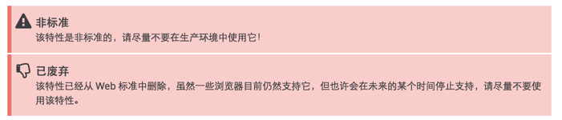

# JS中的call()/apply()/bind()方法

## 1、方法定义
````
call方法: 
语法：call([thisObj[,arg1[, arg2[,   [,.argN]]]]]) 
定义：调用一个对象的一个方法，以另一个对象替换当前对象。 
说明： 
call 方法可以用来代替另一个对象调用一个方法。call 方法可将一个函数的对象上下文从初始的上下文改变为由 thisObj 指定的新对象。 
如果没有提供 thisObj 参数，那么 Global 对象被用作 thisObj。 

apply方法： 
语法：apply([thisObj[,argArray]]) 
定义：应用某一对象的一个方法，用另一个对象替换当前对象。 
说明： 
如果 argArray 不是一个有效的数组或者不是 arguments 对象，那么将导致一个 TypeError。 
如果没有提供 argArray 和 thisObj 任何一个参数，那么 Global 对象将被用作 thisObj， 并且无法被传递任何参数。
 ````

## 2、常用实例
a、
````
function add(a,b)  
{  
    alert(a+b);  
}  
function sub(a,b)  
{  
    alert(a-b);  
} 
add.call(sub,3,1);
````    
 这个例子中的意思就是用 add 来替换 sub，add.call(sub,3,1) == add(3,1) ，所以运行结果为：alert(4); // 注意：js 中的函数其实是对象，函数名是对 Function 对象的引用。
 
b、
````
function Animal(){    
    this.name = "Animal";    
    this.showName = function(){    
        alert(this.name);    
    }    
}    
  
function Cat(){    
    this.name = "Cat";    
}    
   
var animal = new Animal();    
var cat = new Cat();    
    
//通过call或apply方法，将原本属于Animal对象的showName()方法交给对象cat来使用了。    
//输入结果为"Cat"    
animal.showName.call(cat,",");    
//animal.showName.apply(cat,[]);
````  
 call 的意思是把 animal 的方法放到cat上执行，原来cat是没有showName() 方法，现在是把animal 的showName()方法放到 cat上来执行，所以this.name 应该是 Cat
 
c、实现继承
````
function Animal(name){      
    this.name = name;      
    this.showName = function(){      
        alert(this.name);      
    }      
}      
    
function Cat(name){    
    Animal.call(this, name);    
}      
    
var cat = new Cat("Black Cat");     
cat.showName();  
````
 Animal.call(this) 的意思就是使用 Animal对象代替this对象，那么 Cat中不就有Animal的所有属性和方法了吗，Cat对象就能够直接调用Animal的方法以及属性了.
 
d、多重继承
````
function Class10()  
{  
    this.showSub = function(a,b)  
    {  
        alert(a-b);  
    }  
}  
  
function Class11()  
{  
    this.showAdd = function(a,b)  
    {  
        alert(a+b);  
    }  
}  
  
function Class2()  
{  
    Class10.call(this);  
    Class11.call(this);  
} 
```` 
 很简单，使用两个 call 就实现多重继承了
当然，js的继承还有其他方法，例如使用原型链，这个不属于本文的范畴，只是在此说明call 的用法。说了call ，当然还有 apply，这两个方法基本上是一个意思，区别在于 call 的第二个参数可以是任意类型，而apply的第二个参数必须是数组，也可以是arguments
还有 callee，caller..

## bind

bind是在EcmaScript5中扩展的方法（IE6,7,8不支持）
bind() 方法与 apply 和 call 很相似，也是可以改变函数体内 this 的指向。

MDN的解释是：bind()方法会创建一个新函数，称为绑定函数，当调用这个绑定函数时，绑定函数会以创建它时传入 bind()方法的第一个参数作为 this，传入 bind() 方法的第二个以及以后的参数加上绑定函数运行时本身的参数按照顺序作为原函数的参数来调用原函数。

注意：bind方法的返回值是函数
````
var bar=function(){   
  console.log(this.x);   
}
var foo={ 
     x:3   
}   
bar();  
bar.bind(foo)();
 /*或*/
var func=bar.bind(foo);   
func();
````
输出：
````
undefined
3
````

### apply、call、bind比较

那么 apply、call、bind 三者相比较，之间又有什么异同呢？何时使用 apply、call，何时使用 bind 呢。简单的一个栗子：
````
var obj = {
    x: 81,
};
 
var foo = {
    getX: function() {
        return this.x;
    }
}
 
console.log(foo.getX.bind(obj)());  //81
console.log(foo.getX.call(obj));    //81
console.log(foo.getX.apply(obj));   //81
````
三个输出的都是81，但是注意看使用 bind() 方法的，他后面多了对括号。

也就是说，区别是，*当你希望改变上下文环境之后并非立即执行，而是回调执行的时候，使用 bind() 方法*。而 apply/call 则会立即执行函数。

再总结一下：
````
apply 、 call 、bind 三者都是用来改变函数的this对象的指向的；
apply 、 call 、bind 三者第一个参数都是this要指向的对象，也就是想指定的上下文；
apply 、 call 、bind 三者都可以利用后续参数传参；
bind 是返回对应函数，便于稍后调用；apply 、call 则是立即调用 。
````

# JS 对象添加 getter与 setter 的5种方法以及配置属性参数

## 定义 getter 与 setter

>通过对象初始化器定义

>使用 Object.create 方法

>使用 Object.defineProperty 方法

>使用 Object.defineProperties 方法

>使用 Object.prototype.__defineGetter__ 以及 Object.prototype.__defineSetter__ 方法

### 什么是属性描述符
创建属性不可配置不可枚举的对象
````
Enumerable 不可枚举和遍历，
Configurable 设置是否可以重新配置
Writeable 设置值是否可以重新写
````

### 1.通过对象初始化器在创建对象的时候指明（也可以称为通过字面值创建对象时声明）
````
(function () {
    var o = {
        a : 7,
        get b(){return this.a +1;},//通过 get,set的 b,c方法间接性修改 a 属性
        set c(x){this.a = x/2}
    };
    console.log(o.a);
    console.log(o.b);
    o.c = 50;
    console.log(o.a);
})();
````

输出结果如下：
````
7
8
25
````

当然 get 语句与 set 语句可以声明多次用来对应多个 getter 和 setter
使用这种方法的好处是可以在声明属性的时候同时声明对应的 getter 和 setter


### 2.使用 Object.create 方法
````
概述
    Object.create() 方法创建一个拥有指定原型和若干个指定属性的对象。

语法
    Object.create(proto, [ propertiesObject ])
````

我们都知道使用 Object.create 方法传递一个参数的时候可以创建一个以该参数为原型的对象, 第二个参数是可选项，是一个匿名的参数对象，该参数对象是一组属性与值，该对象的属性名称将是新创建的对象的属性名称，值是属性描述符（包扩数据描述符或存取描述符，具体解释看后面的内容 什么是属性描述符）。
通过属性描述符我们可以实现为新创建的对象添加 get 方法以及 set 方法
````
(function () {
    var o = null;
    o = Object.create(Object.prototype,//指定原型为 Object.prototype
            {
                bar:{
                    get :function(){
                        return 10;
                    },
                    set : function (val) {
                        console.log("Setting `o.bar` to ",val);
                    }
                }
            }//第二个参数
        );
    console.log(o.bar);
    o.bar = 12;
})();
````
输出结果如下：
````
10
Setting `o.bar` to  12
````

上面这个例子并没有用来针对的 get 方法以及 set 方法使用的属性
````
(function () {
    var o = null;
    o = Object.create(Object.prototype,//指定原型为 Object.prototype
            {
                bar:{
                    get :function(){
                        return this.a;
                    },
                    set : function (val) {
                        console.log("Setting `o.bar` to ",val);
                        this.a = val;
                    },
                    configurable :true
                }
            }//第二个参数
        );
    o.a = 10;
    console.log(o.bar);
    o.bar = 12;
    console.log(o.bar);
})();
````
亦或：
````
(function () {
    var o = {a:10};
    o = Object.create(o,//指定原型为 o 这里实际可以理解为继承
            {
                bar:{
                    get :function(){
                        return this.a;
                    },
                    set : function (val) {
                        console.log("Setting `o.bar` to ",val);
                        this.a = val;
                    },
                    configurable :true
                }
            }//第二个参数
        );
    console.log(o.bar);
    o.bar = 12;
    console.log(o.bar);
})();
````
输出结果如下：
````
10
Setting `o.bar` to  12
12
````

使用这种方式的好处是可配置性高，但初学者容易迷糊。

### 3.使用 Object.defineProperty 方法
````
概要
    Object.defineProperty() 方法直接在一个对象上定义一个新属性，或者修改一个已经存在的属性， 并返回这个对象。
语法
    Object.defineProperty(obj, prop, descriptor)
参数
    obj
        需要定义属性的对象。
    prop
        需被定义或修改的属性名。
    descriptor
        需被定义或修改的属性的描述符。
        
(function () {
    var o = { a : 1}//声明一个对象,包含一个 a 属性,值为1
    Object.defineProperty(o,"b",{
        get: function () {
            return this.a;
        },
        set : function (val) {
            this.a = val;
        },
        configurable : true
    });

    console.log(o.b);
    o.b = 2;
    console.log(o.b);
})();
````
这个方法与前面两种的区别是：使用前面两种只能在*声明定义的时候*指定 getter 与 setter，使用该方法可以随时的添加或修改。
如果说需要一次性批量添加 getter 与 setter 也是没问题的，使用如下方法：

## 4.使用 Object.defineProperties方法
````
概述
    Object.defineProperties() 方法在一个对象上添加或修改一个或者多个自有属性，并返回该对象。
语法
    Object.defineProperties(obj, props)
参数
    obj
    将要被添加属性或修改属性的对象
    props
    该对象的一个或多个键值对定义了将要为对象添加或修改的属性的具体配置
    
````
不难看出用法与 Object.defineProperty 方法类似
````
(function () {
    var obj = {a:1,b:"string"};
    Object.defineProperties(obj,{
        "A":{
            get:function(){return this.a+1;},
            set:function(val){this.a = val;}
        },
        "B":{
            get:function(){return this.b+2;},
            set:function(val){this.b = val}
        }
    });

    console.log(obj.A);
    console.log(obj.B);
    obj.A = 3;
    obj.B = "hello";
    console.log(obj.A);
    console.log(obj.B);
})();
````
输出结果如下：
````
2
string2
4
hello2
````

### 5.使用 Object.prototype.__defineGetter__ 以及 Object.prototype.__defineSetter__ 方法
````
(function () {
    var o = {a:1};
    o.__defineGetter__("giveMeA", function () {
        return this.a;
    });
    o.__defineSetter__("setMeNew", function (val) {
        this.a  = val;
    })
    console.log(o.giveMeA);
    o.setMeNew = 2;
    console.log(o.giveMeA);
})();
````
输出结果为1和2
查看 MDN 有如下说明：


## 什么是属性描述符

对象里目前存在的属性描述符有两种主要形式：数据描述符和存取描述符。
>数据描述符是一个拥有可写或不可写值的属性。

>存取描述符是由一对 getter-setter 函数功能来描述的属性。

描述符必须是两种形式之一；不能同时是两者。
数据描述符和存取描述符均具有以下可选键值：
````
configurable
    当且仅当这个属性描述符值为 true 时，该属性可能会改变，也可能会被从相应的对象删除。默认为 false。
enumerable  
    true 当且仅当该属性出现在相应的对象枚举属性中。默认为 false。
````

数据描述符同时具有以下可选键值：
````
value 
    与属性相关的值。可以是任何有效的 JavaScript 值（数值，对象，函数等）。默认为 undefined。
writable 
    true 当且仅当可能用 赋值运算符 改变与属性相关的值。默认为 false。
````

存取描述符同时具有以下可选键值：
````
get 
    一个给属性提供 getter 的方法，如果没有 getter 则为 undefined。方法将返回用作属性的值。默认为 undefined。
set
    一个给属性提供 setter 的方法，如果没有 setter 则为 undefined。该方法将收到作为唯一参数的新值分配给属性。默认为 undefined。
````
以上是摘自MDN的解释，看起来是很晦涩的，具体什么意思呢：
首先我们从以上解释知道该匿名参数对象有个很好听的名字叫属性描述符，属性描述符又分成两大块：数据描述符以及存取描述符（其实只是一个外号，给指定的属性集合起个外号）。

数据描述符包括两个属性 : value 属性以及 writable 属性，第一个属性用来声明当前欲修饰的属性的值，第二个属性用来声明当前对象是否可写即是否可以修改

存取描述符就包括 get 与 set 属性用来声明欲修饰的象属性的 getter 及 setter

属性描述符内部，数据描述符与存取描述符只能存在其中之一，但是不论使用哪个描述符都可以同时设置 configurable 属性以及enumerable 属性。
configurable属性用来声明欲修饰的属性是否能够配置，仅有当其值为 true 时，被修饰的属性才有可能能够被删除，或者重新配置。
enumerable 属性用来声明欲修饰属性是否可以被枚举。

知道了什么是属性描述符，我们就可以开始着手创建一些对象并开始配置其属性

### 创建属性不可配置不可枚举的对象
````
//使用默认值配置
(function () {
    var obj = {};//声明一个空对象
    Object.defineProperty(obj,"key",{
        value:"static"
                        //没有设置 enumerable 使用默认值 false
                        //没有 configurable 使用默认值 false
                        //没有 writable 使用默认值 false
    });

    console.log(obj.key);           //输出 “static”
    obj.key = "new"                 //尝试修改其值,修改将失败,因为 writable 为 false
    console.log(obj.key);           //输出 “static”
    obj.a = 1;//动态添加一个属性
    for(var item in obj){ //遍历所有 obj 的可枚举属性
         console.log(item);
    }//只输出一个 “a” 因为 “key”的 enumerable为 false
})();
//显示配置 等价于上面
(function () {
    var obj = {};
    Object.defineProperty(obj,"key",{
        enumerable : false,
        configurable : false,
        writable : false,
        value : "static"
    })
})();

//等价配置
(function () {
    var o = {};
    o.a = 1;
    //等价于
    Object.defineProperty(o,"a",{value : 1,
                                writable : true,
                                configurable : true,
                                enumerable : true});
    
    Object.defineProperty(o,"a",{value :1});
    //等价于
    Object.defineProperty(o,"a",{value : 1,
                                writable : false,
                                configurable : false,
                                enumerable : false});
})();
````
### Enumerable 特性
属性特性 enumerable 决定属性是否能被 for...in 循环或 Object.keys 方法遍历得到
````
(function () {
    var o = {};
    Object.defineProperty(o,"a",{value :1,enumerable :true});
    Object.defineProperty(o,"b",{value :2,enumerable :false});
    Object.defineProperty(o,"c",{value :2});//enumerable default to false
    o.d = 4;//如果直接赋值的方式创建对象的属性,则这个属性的 enumerable 为 true

    for(var item in o){ //遍历所有可枚举属性包括继承的属性
        console.log(item);
    }

    console.log(Object.keys(o));//获取 o 对象的所有可遍历属性不包括继承的属性

    console.log(o.propertyIsEnumerable('a'));//true
    console.log(o.propertyIsEnumerable('b'));//false
    console.log(o.propertyIsEnumerable('c'));//false
})();
````
输出结果如下：
````
a
d
[ 'a', 'd' ]
true
false
false
````

### Configurable 特性
````
(function () {
    var o = {};
    Object.defineProperty(o,"a",{get: function () {return 1;},
                                configurable : false} );
                                //enumerable 默认为 false,
                                //value 默认为 undefined,
                                //writable 默认为 false,
                                //set 默认为 undefined
                                  
    //抛出异常,因为最开始定义了 configurable 为 false,故后期无法对其进行再配置
    Object.defineProperty(o,"a",{configurable : true} );
    //抛出异常,因为最开始定义了 configurable 为 false,故后期无法对其进行再配置,enumerable 的原值为 false
    Object.defineProperty(o,"a",{enumerable : true} );
    //抛出异常,因为最开始定义了 configurable 为 false,set的原值为 undefined
    Object.defineProperty(o,"a",{set : function(val){}} );
    //抛出异常,因为最开始定义了 configurable 为 false,故无法进行覆盖,尽管想用一样的来覆盖
    Object.defineProperty(o,"a",{get : function(){return 1}});
    //抛出异常，因为最开始定义了 configurable 为 false,故无法将其进行重新配置把属性描述符从存取描述符改为数据描述符
    Object.defineProperty(o,"a",{value : 12});

    console.log(o.a);//输出1
    delete o.a;      //想要删除属性,将失败
    console.log(o.a);//输出1
    
})();
````

## 提高及扩展
1.属性描述符中容易被误导的地方之 writable 与 configurable
````
(function () {
    var o = {};
    Object.defineProperties(o,{
        "a": {
            value:1,
            writable:true,//可写
            configurable:false//不可配置
            //enumerable 默认为 false 不可枚举
        },
        "b":{
            get :function(){
                return this.a;
            },
            configurable:false
        }
    });
    console.log(o.a);   //1
    o.a = 2;            //修改值成功,writable 为 true
    console.log(o.a);   //2
    Object.defineProperty(o,"a",{value:3});//同样为修改值成功
    console.log(o.a);   //3

    //将其属性 b 的属性描述符从存取描述符重新配置为数据描述符
    Object.defineProperty(o,"b",{value:3});//抛出异常,因为 configurable 为 false
})();
````
2.通过上面的学习，我们都知道传递属性描述符参数时，是定义一个匿名的对象，里面包含属性描述符内容，若每定义一次便要创建一个匿名对象传入，将会造成内存浪费。故优化如下：
````
(function () {
    var obj = {};

    //回收同一对象,即减少内存浪费
    function withValue(value){
        var d = withValue.d ||(
            withValue.d = {
                enumerable : false,
                configurable : false,
                writable : false,
                value :null
            }
            );
        d.value = value;
        return d;
    }
    Object.defineProperty(obj,"key",withValue("static"))
})();
````

# 原型继承
````
function A(){
    this.name = "A function";
}

A.prototype.run = function(){
    console.log(this.name, " runing");
}

function B(){
    this.name = "B function";
    A.call(this) //只能执行A构造函数，继承相关属性
}

Object.setPrototypeOf(B.prototype, A.prototype);//继承A的相关原型方法
//B.prototype.__proto__ = A.prototype; 也可以这么赋值
//B.prototype = A.prototype; 也可以这么赋值

var b = new B();
console.log(b)
b.run();

````
输入结果如下：
````
B { name: 'A function' }
A function  runing
````

setPrototypeOf比较新的方法，兼容多浏览器可以使用
````
// Only works in Chrome and FireFox, does not work in IE:
Object.setPrototypeOf = Object.setPrototypeOf || function(obj, proto) {
  obj.__proto__ = proto;
  return obj; 
}
````

# JS的prototype和__proto__

## 一、prototype和__proto__的概念

>prototype是函数的一个属性（每个函数都有一个prototype属性），这个属性是一个指针，指向一个对象。它是显示修改对象的原型的属性。

>__proto__是一个对象拥有的内置属性（请注意：prototype是函数的内置属性，__proto__是对象的内置属性），是JS内部使用寻找原型链的属性。

*用chrome和FF都可以访问到对象的__proto__属性，IE不可以。*

## 二、new 的过程
````
var Person = function(){};
var p = new Person();
````
new的过程拆分成以下三步：
>(1) var p={}; 也就是说，初始化一个对象p

>(2) p.__proto__ = Person.prototype;

>(3) Person.call(p); 也就是说构造p，也可以称之为初始化p

关键在于第二步，我们来证明一下：
````
var Person = function(){};
var p = new Person();
alert(p.__proto__ === Person.prototype);
````
这段代码会返回true。说明我们步骤2是正确的。

## 三、示例
````
    var Person = function(){};
    Person.prototype.sayName = function() {
        alert("My Name is Jacky");
    };

    Person.prototype.age = 27;
    var p = new Person();
    p.sayName();
````
p是一个引用指向Person的对象。我们在Person的原型上定义了一个sayName方法和age属性，当我们执行p.age时，会先在this的内部查找（也就是构造函数内部），如果没有找到然后再沿着原型链向上追溯。

这里的向上追溯是怎么向上的呢？这里就要使用__proto__属性来链接到原型（也就是Person.prototype）进行查找。最终在原型上找到了age属性。

## 总结
>原型链的形成真正是靠__proto__ 而非prototype，当JS引擎执行对象的方法时，先查找对象本身是否存在该方法，如果不存在，会在原型链上查找，但不会查找自身的prototype。

>一个对象的 __proto__ 记录着自己的原型链，决定了自身的数据类型，改变 __proto__ 就等于改变对象的数据类型。

>函数的 prototype 不属于自身的原型链，它是创建子类的核心，决定了子类的数据类型，是连接子类原型链的桥梁。

>在原型对象上定义方法和属性，是为了被子类继承和使用。

